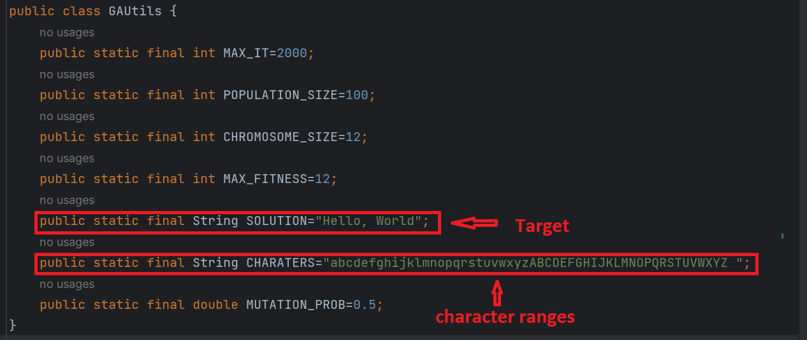
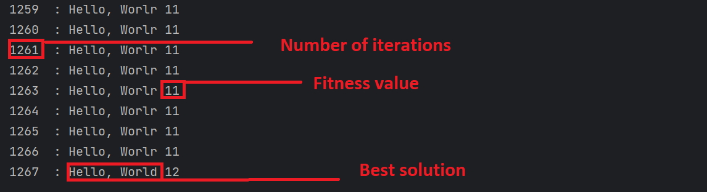

# Genetic Algorithm for Word Search in Java

This project implements a genetic algorithm in Java to search for a specific word or phrase. Each individual in the population represents a word or phrase, and the algorithm evolves the population through selection, crossover, and mutation operations.

## How the Algorithm Works

1. **Initialization**: A population of individuals is randomly generated, where each individual represents a word or phrase.

2. **Fitness Evaluation**: Each individual's fitness is calculated by comparing each character of the word or phrase to the target word or phrase. The fitness function assigns a higher score for characters that are in the correct position.

3. **Selection**: The two individuals with the highest fitness scores are selected from the population. This selection method prioritizes the individuals with the highest fitness.

4. **Crossover**: The selected individuals undergo crossover, which involves exchanging genetic information (characters) to create new offspring. The crossover point(s) can be randomly determined.

5. **Mutation**: Random changes are introduced into the offspring's genetic information (characters) to explore new word combinations. This step helps prevent the algorithm from getting stuck in local optima.

6. **Fitness Recalculation**: The fitness of the offspring is recalculated by comparing it to the target word or phrase. This step ensures that the fitness is up to date after the genetic operations.

7. **Termination Criteria**: The algorithm checks if the target word or phrase has been found. If so, the algorithm stops and returns the best solution. Otherwise, it continues to the next generation up to the number of iterations performed.

8. **Repeat**: Steps 3 to 7 are repeated until the target word or phrase is found or the number of iterations performed.

9. **Return the Best Solution**: Once the algorithm stops because the target word or phrase has been found, the best solution found during the evolution process is returned as the final output.

## Getting Started

To use this genetic algorithm implementation for word search, follow these steps:

1. Clone the repository or download the source code.

2. Import the project into your preferred Java IDE.

3. Configure the algorithm parameters in the source code, such as population size, number of generations, target word or phrase, selection method, crossover and mutation rates, etc.

4. Build and run the project.

## Dependencies

This project has the following dependencies:

- [Jade.jar](tp_sma_ga/jade.jar): The Jade library is used for implementing the multi-agent system framework.

Make sure to download and include the Jade.jar file in your project's dependencies before running the project.

## Example Usage

## Output

