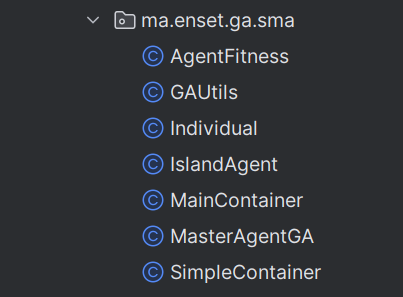

# Parallel and Distributed Genetic Algorithm for Word Search in Java

## Introduction
Parallel genetic algorithm is such an algorithm that uses multiple genetic algorithms to solve a single task [1]. All these algorithms try to solve the same task \and after they’ve completed their job, the best individual of every algorithm is selected, then the best of them is selected, and this is the solution to a problem. This is one of the most popular approach to parallel genetic algorithms, even though there are others. This approach is often called ‘island model’ because populations are isolated from each other, like real-life creature populations may be isolated living on different islands. Image 1 illustrates that.

This project implements a genetic algorithm in Java to search for a specific word or phrase. Each agent represents a population, and the algorithm evolves the populations through selection, reproduction, and evaluation operations.

## Architecture

## Distributed genetic algorithm

Distributed genetic algorithm is actually a parallel genetic algorithm that has its independent algorithms running on separate machines. Moreover, in this case each of these algorithms may be in turn a parallel genetic algorithm! Distributed genetic algorithm also implements the ‘island model’ and each ‘island’ is even more isolated from others. If each machine runs a parallel genetic algorithm we may call this as ‘archipelago model’, because we have groups of islands. It actually does not matter what a single genetic algorithm is, because distributed genetic algorithm is about having multiple machines running independent genetic algorithms in order to solve the same task. Image 2 illustrates this.

Distributed genetic algorithm may also help when we have to create many individuals in order to observe the entire domain, but it is not possible to store all of them in memory of a single machine.

When we were discussing parallel genetic algorithm we introduced the ‘crossover between algorithms’ term. Distributed genetic algorithm enables us to perform crossover between separate machines!

In case of distributed genetic algorithm, we have a kind of ‘master mind’ that controls the overall progress and coordinates these machines. It also controls crossover between machines, selecting how machines will be paired together to perform crossover. In general, process is the same as in case of parallel genetic algorithm, except that individuals are moved over the network from one machine to another. In order to avoid transferring individuals twice, it is recommended to send individuals to the machine, that will receive new individuals created as a result of a crossover operation. The ‘master mind’ also selects the best individual from individuals of secondary machines it is connected to and that were actually running the computation. As a result, this ‘master mind’ is the entry point of a distributed genetic algorithm that communicates with the one, who asks it for a solution.
## Implementation

1. **Initialization**: Multiple populations are randomly generated, with each population represented by an agent. Each population contains individuals representing different word or phrase combinations.

2. **Fitness Evaluation**: Each individual's fitness is calculated by comparing each character of the word or phrase to the target word or phrase. The fitness function assigns a higher score for characters that are in the correct position.

3. **Selection**: The best individual from each population is selected and sent to the main agent. The selection method can be based on the highest fitness score.

4. **Best Solution Determination**: The main agent receives the best individuals from all populations and evaluates them to determine the best solution. This evaluation can involve comparing the fitness scores.

5. **Termination Criteria**: The algorithm checks if the target word or phrase has been found or if a certain number of generations/steps have been reached. If the termination criteria are met, the algorithm stops and returns the best solution. Otherwise, it continues to the next generation.

6. **Reproduction**: The main agent can create new populations or generate offspring individuals based on the best individuals received. This step can involve crossover, mutation, or other genetic operations to explore new word combinations.

7. **Repeat**: Steps 2 to 6 are repeated until the termination criteria are met or the target word or phrase is found.

8. **Return the Best Solution**: Once the algorithm stops because the termination criteria are met or the target word or phrase is found, the best solution found during the evolution process is returned as the final output.

## Getting Started

To use this genetic algorithm implementation for word search, follow these steps:

1. Clone the repository or download the source code.

2. Import the project into your preferred Java IDE.

3. Configure the algorithm parameters in the source code, such as population size, number of generations, target word or phrase, selection method, crossover and mutation rates, etc.

4. Build and run the project, run MainContainer first and SimpleContainer second.

## Dependencies

This project has the following dependencies:

- [Jade.jar](tp_sma_ga/jade.jar): The Jade library is used for implementing the multi-agent system framework.

Make sure to download and include the Jade.jar file in your project's dependencies before running the project.

## Input

## Output

## Conclusion

Using parallel and distributed genetic algorithms one can increase performance of the system that uses evolutionary algorithms. Anyway, we should keep in mind that evolutionary algorithms do not guarantee that a solution will ever be found and that there no more optimal solutions than the one that was found.

One of the main issues we have to deal with while using genetic algorithms is preliminary convergence to a subset of individuals that dominate others. Parallel and distributed genetic algorithms try to address it introducing differences between algorithms that make them to have different set of individuals.

With parallel and distributed genetic algorithms individuals are more divergent, as a result it is possible to create les individuals than using non-parallel genetic algorithm, keeping solution quality at the same rates.